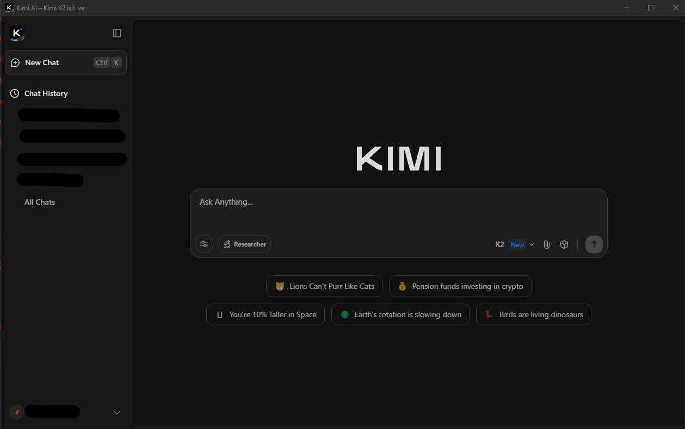

# Kimi AI Desktop

Kimi AI on your desktop — simple, fast, and ready to use.

---

## Features

- Minimal and lightweight desktop app
- Tray icon for quick access
- Windows installer (`.exe`) already built
- Auto-hide menu bar for a clean interface
- Easy to launch and run

---

## Screenshots



---

## Installation

1. Download or clone the repository:

```bash
git clone https://github.com/Sysdriver0/Kimi-AI-Desktop.git
cd Kimi-AI-Desktop
npm run build
